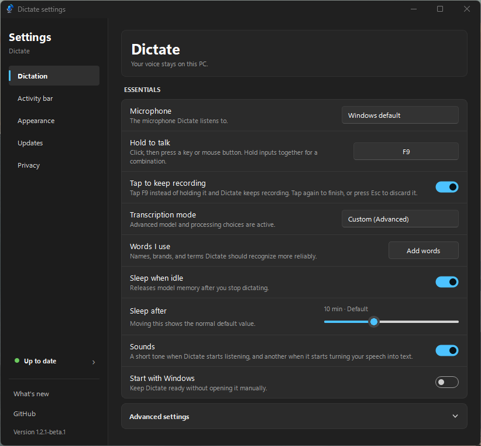
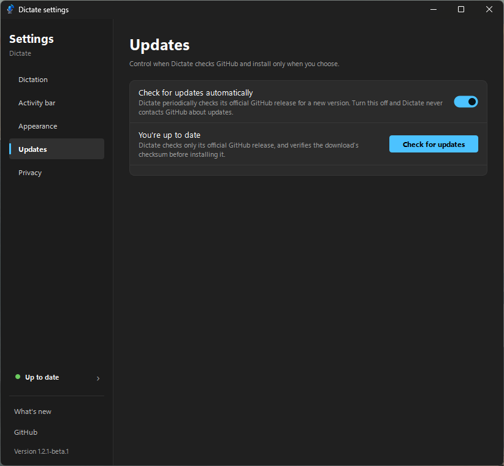
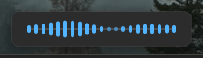

# Dictate

> A local, push-to-talk transcription tool that feels at home on Windows 11.

[](https://github.com/PLEXFX/dictate/releases) [](https://www.microsoft.com/windows/windows-11) [](LICENSE)

Hold a key anywhere in Windows, speak, and release. Dictate transcribes on your PC and inserts the result wherever your cursor is—no account, no cloud transcription service, and no transcript history.

Dictate is currently a **public beta**. It is built for everyday use, but behavior, settings, and installer details may change as it matures. Please report rough edges through [GitHub Issues](https://github.com/PLEXFX/dictate/issues).

## What it feels like

Dictate lives quietly in the system tray. While you speak, a small Windows 11-style activity bar appears above the taskbar using your system accent color. Its waveform gives immediate feedback without covering what you are working on. Settings use a familiar Windows-style navigation rail, automatic saving, light/dark surfaces, and plain-language controls.

## Windows 11, at a glance

| Dictation settings | Updates, on your terms |
| --- | --- |
|  |  |

<p align="center">
  
</p>

<p align="center"><em>Quiet when idle. Clear while listening. Out of the way when you are done.</em></p>

## Get started

1. Download the latest `Dictate-Setup-*.exe` from [Releases](https://github.com/PLEXFX/dictate/releases).
2. Run Setup and choose whether to enable optional NVIDIA GPU acceleration.
3. Open Dictate from Start. On first launch, choose a microphone and follow the short welcome flow.
4. Hold `F9`, speak, then release—the text is pasted into the focused app.

There is no Python or manual setup required for the installer.

> **Windows SmartScreen:** Dictate is not code-signed yet, so Windows may show an “unrecognized publisher” warning on first install. Select **More info** → **Run anyway** only after downloading from this repository’s official Releases page.

## Everyday controls

| Action | Default | Result |
| --- | --- | --- |
| Dictate | Hold `F9` | Record while held; release to transcribe and paste |
| Longer dictation | Tap `F9` | Lock recording on; tap again to finish or `Esc` to cancel |
| Open Settings | `Ctrl` + `Alt` + `D` | Adjust microphone, shortcuts, appearance, updates, and privacy |
| Tray icon | Left/right click | Open Settings or access quick actions such as copy, undo, unload, and quit |

Dictate automatically adds one separating space after an inserted result. **Undo last dictation** is deliberately cautious: it only acts when the app can be confident it will undo its own most recent insertion.

## Local by design

- Microphone audio and dictated text stay on your device.
- Dictate does not save recordings or maintain a transcript history.
- Speech models download locally on first use. Optional GPU runtime files download only if you choose GPU acceleration.
- Update checks contact the official GitHub repository only when enabled.

Read the full [privacy statement](PRIVACY.md).

## Thoughtful Windows 11 details

- A compact, system-accent activity bar above the taskbar—smooth feedback, no distracting main window.
- Familiar Settings pages for Dictation, Activity bar, Appearance, Updates, and Privacy.
- Light/dark appearance with Windows Acrylic when transparency effects are enabled.
- Configurable keyboard or mouse hold-to-talk shortcuts, microphone selection, sleep behavior, sounds, and startup.
- Background update checks with a visible, user-initiated download and verified installer before restart.
- CPU-first operation; optional NVIDIA GPU acceleration for faster long-form dictation.

## Updates and beta releases

Dictate can check GitHub for updates at launch and periodically in the background. It never installs or restarts without your action: when an update is available, choose it from the activity bar or Settings; after the installer is downloaded and verified, choose **Restart to finish**.

Every release has notes in [CHANGELOG.md](CHANGELOG.md). The current beta, **v1.2.2-beta.1**, is a stability and reliability pass: a corrupt settings file can no longer prevent launch, dictations are no longer discarded when the clipboard is unavailable, and the appearance and update controls in Settings behave correctly.

## Run from source

Dictate targets Windows 11 and Python 3.12. [uv](https://docs.astral.sh/uv/) is required for local development.

```powershell
uv venv --python 3.12 .venv
uv pip install --python .venv\Scripts\python.exe -r pyproject.toml
.\run-dictate-debug.bat
```

Use `run-dictate.bat` for normal tray operation. `run-dictate-debug.bat` keeps a diagnostic console open and supports `help` for useful local commands.

Run the test suite with:

```powershell
.\.venv\Scripts\python.exe -m unittest discover -s tests -v
```

## Contributing

Bug reports, usability feedback, and small focused improvements are welcome during beta. Start with [CONTRIBUTING.md](CONTRIBUTING.md), search existing issues before opening a new one, and keep proposals grounded in the app’s [Windows 11 design direction](DESIGN.md).

For security-sensitive reports, please follow [SECURITY.md](SECURITY.md) rather than opening a public issue.

## Project notes

- Dictate uses [faster-whisper](https://github.com/SYSTRAN/faster-whisper) on CTranslate2 rather than PyTorch.
- The default `small.en` model balances accuracy and responsiveness; additional model and processing choices live in **Advanced settings**.
- Model files live under `%APPDATA%\dictate\models`, separate from the source folder.
- GPU support is optional. If it is not installed, Dictate safely stays on CPU.

## License

Dictate is available under the [MIT License](LICENSE).
